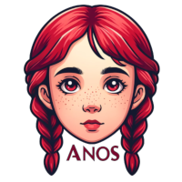

# AnOS



> The name of the project is based on the prefix of my wife personal name. [WIP]

requirements:

* [bootimage][bootimage]

## Build

```console
make build
```

## License

AnOS is distributed under the terms of the ISC license.

See [LICENSE](LICENSE)

[bootimage]: https://crates.io/crates/bootimage
